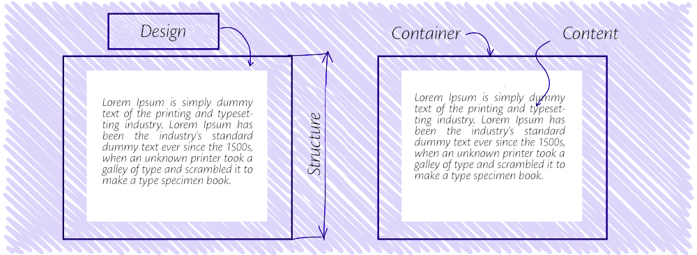
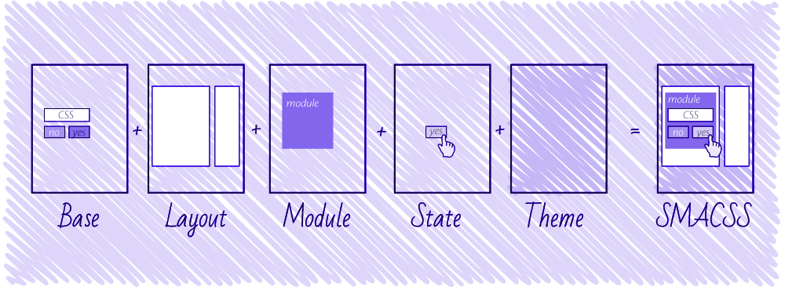
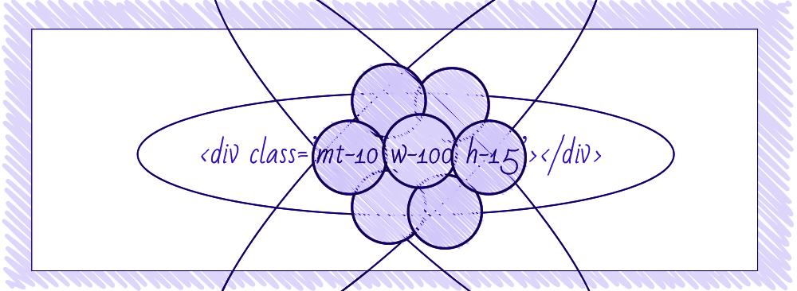
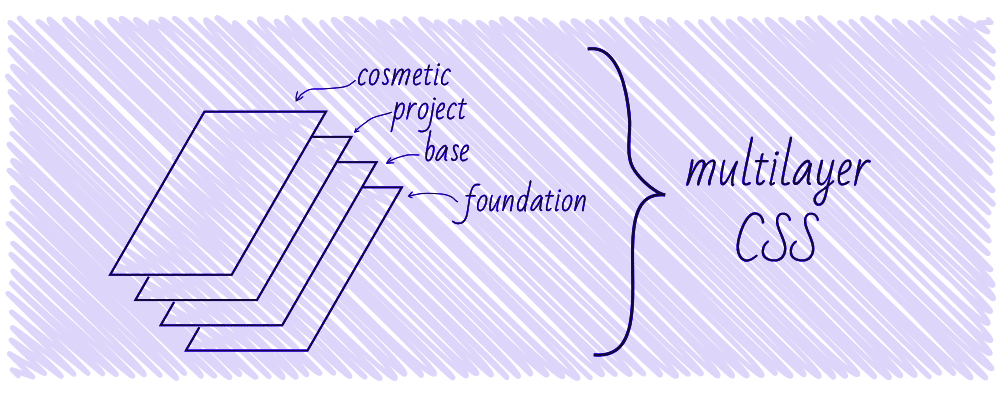
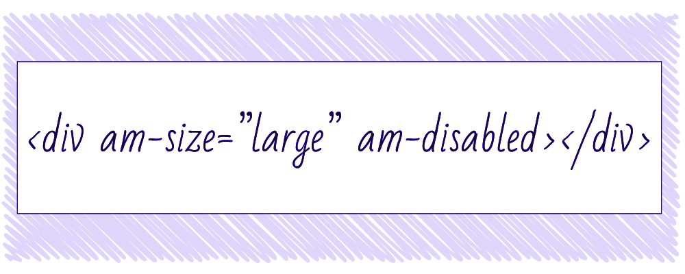
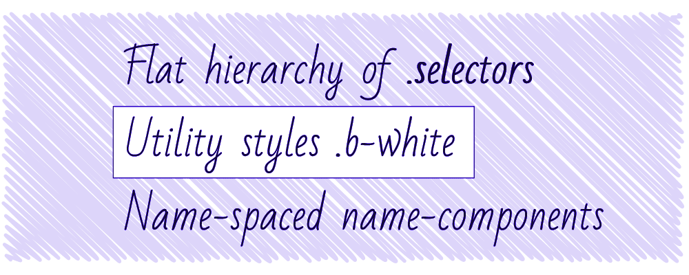

# Methods to Organize CSS

## OOCSS

- [Methods to Organize CSS](https://css-tricks.com/methods-organize-css/#article-header-id-0)
- [CSS設計における3大メソッド](http://www.risewill.co.jp/blog/archives/5652)

## SMACSS

- [Methods to Organize CSS](https://css-tricks.com/methods-organize-css/#article-header-id-1)

## BEM

## Atomic CSS

- [Methods to Organize CSS](https://css-tricks.com/methods-organize-css/#article-header-id-2)

## MCSS

- [Methods to Organize CSS](https://css-tricks.com/methods-organize-css/#article-header-id-3)

## AMCSS

- [Methods to Organize CSS](https://css-tricks.com/methods-organize-css/#article-header-id-4)

## FUN

- [Methods to Organize CSS](https://css-tricks.com/methods-organize-css/#article-header-id-5)
